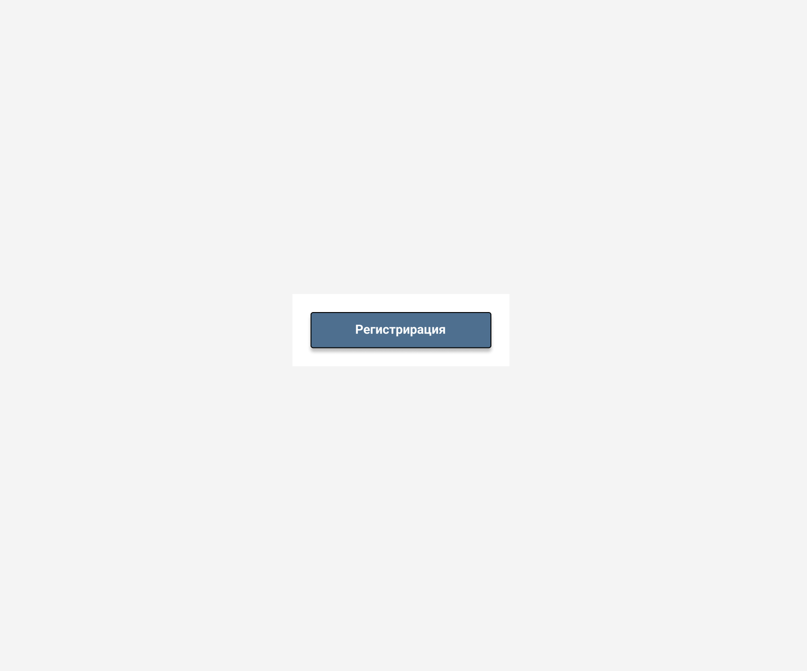
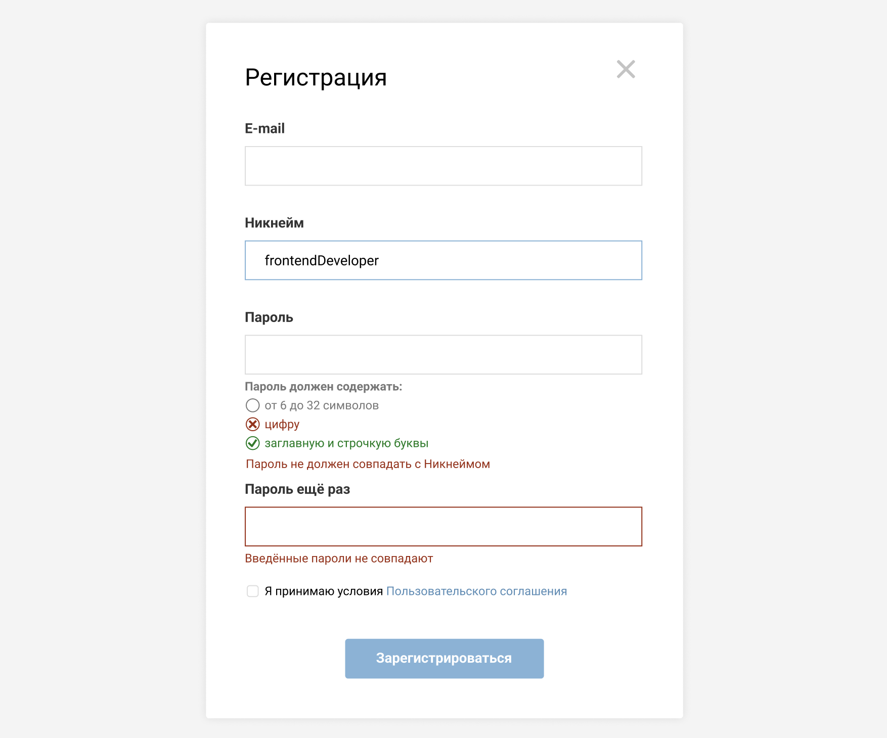

# reg-form-2

## Техническое задание:

### Базовая часть
1. По центру начального экрана располагается кнопка регистрации как на макете
   (страница desktop полотно Desktop 1).
2. После нажатия на кнопку появляется модальное окно (страница desktop
   полотно Desktop 2). При желании можно добавить эффект появления на
   усмотрение работника.
3. Состояния всех полей есть на отдельных страницах документа. Если каких то
   состояний не хватает, их нужно добавить, по возможности в стилистике
   имеющимися состояний.
4. После нажатия на крестик в правом верхнем углу, форма закрывается, а уже
   заполненные данные удаляются.
5. Кнопка зарегистрироваться модального окна не активна до тех пор пока все
   поля формы не заполнены верно.
6. При нажатии на кнопку зарегистрироваться модального окна:\
   a. Страница не перезагружается;\
   b. Данные из формы собираются в json и выводятся в консоль браузера;\
   c. Модальное окно закрывается, а кнопка открывающая модальное окно
   становится зелёной и неактивной.
7. Валидация полей реализована согласно ТЗ.

### Валидация полей:
1. Все поля указанные в макете обязательные.
2. Текст ошибки должен явно говорить что пользователь сделал не верно.
3. Ошибку стоит выводить после того как пользователь перестал заполнять поле,
   а скрывать ошибку как только она была исправлена.
4. E-mail должен быть валидным адресом электронной почты.
5. Никнейм может содержать только:\
   a. От 3 до 40 символов\
   b. Латинские буквы\
   c. Цифры\
   d. Символ подчёркивания (_)
6. Никнейм может начинаться только с буквы.
7. Никнейм содержит;
8. Пароль должен содержать:\
   a. От 6 до 32 символов\
   b. Минимум по одной заглавной и строчной букве\
   c. Минимум одну цифру
9. Пароль не должен совпадать с ником или почтовым адресом
10. На макете под полем пароля есть требования к паролю. По умолчанию все
    правила в состоянии default. Как только какое то из условий выполняется, оно
    переходит в состояние ok. Если после того как условие единожды было
    выполненным перестаёт быть верным - условие переходит в состояние error.\
    На пример:\
    a. Пользователь только зашел на страницу и открыл модалку - все правила
    серого цвета.\
    b. Пользователь начал вводить пароль и ввёл только одну маленькую
    букву - ничего не поменялось.\
    c. Если стереть эту букву тоже ничего не должно меняться.\
    d. Если к одной маленькой букве дописать одну большую, то правило на то
    что пароль содержит одну маленькую и одну большую буквы выполнено
    и становится зелёным, а остальные по прежнему серые.\
    e. Если к двум буквам добавить цифру то будет верно уже два правила и
    они станут зелёными.\
    f. Если удалить одну из букв то правило о буквах перестанет быть верным
    и оно должно стать красным. Правило на длину пароля по прежнему
    серое, а т.к. цифра по прежнему есть в пароле то правило на цифру всё
    ещё зелёное.\
    g. Если ввести валидный пароль, то все правила должны быть в состоянии
    ok, если после этого удалить пароль, все правила должны покраснеть.
11. По умолчанию галочка около условий пользовательского соглашения не стоит,
    но она обязательна для заполнения пользователем.
12. Слова Пользовательского соглашения - это ссылка которая ведёт на отдельную
    страницу. Саму страницу верстать не надо.\
    \
    Если есть какие то замечания, советы или исправления - предлагайте и объясняйте
    почему вы считаете, что лучше сделать иначе.\

### Дополнительная часть
1. Дополнить форму регистрации вторым шагом (на первом экране кнопку
   зарегистрироваться поменять на кнопку далее).
2. Кнопка далее первого шага модального окна не активна до тех пор пока все
   поля первого шага формы не заполнены верно.
3. На втором шаге размести не обязательные для заполнения поля:\
   a. Выбор пола (М/Ж) в виде полей с типом radio;\
   b. Выбор уровня образования в виде выпадающего списка.\
   c. Поле рассказать о себе;\
   d. Выбор рубрик на которые хочет подписаться новый пользователь
   (можно взять рубрики с федерального сайта МК - политика, экономика,
   происшествия...) в виде checkbox-ов;
4. После всех полей второго шага размещается кнопка зарегистрироваться, по
   нажатию на которую происходит всё то что описано в шестом пункте базовой
   части.
5. Дизайн второго шага регистрации должен быть на первый.

### Замечания, советы или исправления по тестовому заданию с пояснениями:
1. В части Валидация полей пункт 10.b (и c. об этом же) говорится: “Пользователь начал вводить пароль и ввёл только одну маленькую букву - ничего не поменялось.” Но фактически не соблюдается правило валидации о количестве символов и, логично, если при этом поведении пользователя должно “покраснеть” правило “от 6 до 32 символов” под полем пароля.
2. Добавил дополнительный способ закрытия модального окна по клику вне его области. Также работает способ закрытия по Esc.
3. Добавил стилизацию не активной кнопки отправки формы. Также первоначально сделал ее не активной.
4. В части Валидации полей пункт 7: лучше не использовать спецсимволы в никнейме.
5. Согласно пункту 9 в части Валидации полей, логично будет добавить данное требование (пароль кроме всего прочего не должен совпадать с email) к описанным для пользователя правилам заполнения поля ввода Пароля.
6. Обработал множество случаев для корректной работы валидации.


Макеты к заданию:




### Реализация:
- Реализовано с использованием JavaScript, TypeScript, SASS(SCSS), Webpack, ESLint, Prettier, Babel.

## Установка

```bash
yarn install
```

Запуск

```bash
yarn start
```

## Команды

* ```yarn run dev``` - сборка development
* ```yarn run build``` - сборка production
* ```yarn start``` - слежение за файлами и открытие в браузере
* ```yarn run stats``` - просмотр размера и статы бандла


